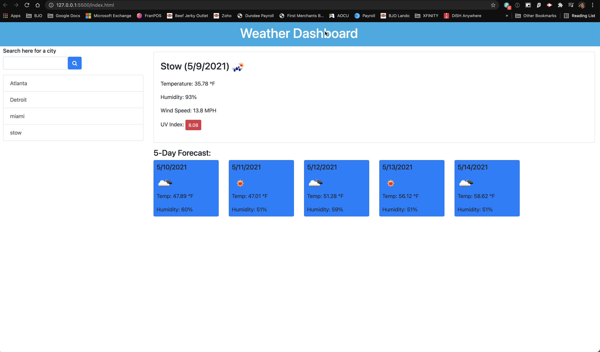

# weather-dashboard
 Week 6 Homework

 ## License
  

Link:  https://mkassem917.github.io/weather-dashboard/

Github: https://github.com/mkassem917/weather-dashboard 

## Screenshot

**Description**

Weather dashboard using the OpenWeather API for showcasing multiply days at a time. 
 

**All criteria has been met from the homework README.md file**

**Contents:**

* index.html
* script.js
* License
* assets  folder - Contains screenshot
* README.md

**Tools Used:**

* JavaScript
* OpenWeather API
* HTML
* CSS

  
  
  
  
  
  
  

  

